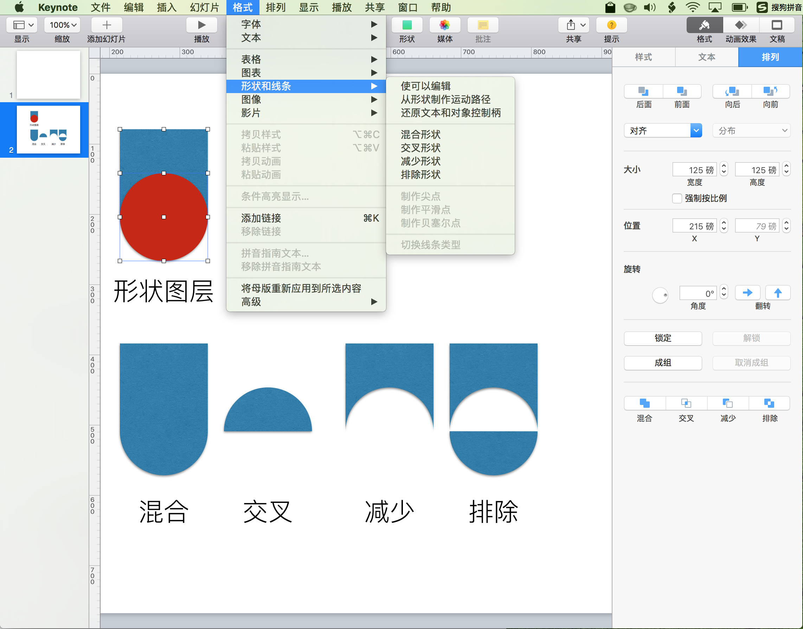
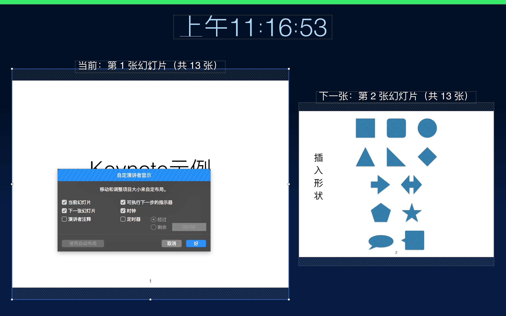

`⌥⌘T`：显示/隐藏 工具栏  
`⌘R`：显示/隐藏 标尺  

## 左侧边栏
从 **`显示`** 菜单或点击工具栏中的 `显示` 按钮可指定显示模式：

- 左侧边栏缩略图导航模式  
- 左侧边栏页码列表大纲模式  
- 看片台：主视图宫格缩略图概览  
- 仅幻灯片：**隐藏**左侧边栏，仅显示内容区主视图  

1. 显示/隐藏 **_标尺_**

	> 插入 **文本框**、**线条**、**形状**、**表格**、**图表** 等对象混排时提供标尺参考，以便排版和对齐。

2. 显示/隐藏 **_标注_**

	> 标注为显示在内容区主视图的悬浮**黄色便笺**。

3. 显示/隐藏 **_演讲者注释_**

	> 显示或隐藏**底栏**演讲者注释。

## 添加幻灯片
点击工具栏中的 `+` 可添加指定格式模板的幻灯片新页。

## 插入对象
从 **`插入`** 菜单或工具栏中可选择插入 **文本框**、**线条**、**形状**、**表格**（标题、基本、普通、求和）、**图表**（二维、三维、交互式）、批注 等多媒体对象。

选择文本框，从屏幕顶部的“格式”菜单中选取“高级”>“**设定为默认文本框外观**”。

选择对象，可右键 `添加链接`，执行跳转动作。

## 幻灯片页码编号
菜单 `幻灯片|显示所有幻灯片上的幻灯片编号`，可显示页码。

## 检查器（右侧边栏）
双击 `格式`、`动画效果`、`文稿` 任一菜单，则可隐藏右侧边栏。

### 格式

内容区主视图，不选择任何对象，可设置幻灯片布局格式。

选定特定对象，有其特定的**格式**参数设置。

- 线条：样式、排列  
- 文本框/形状：样式、文本、排列  
- 表格：表格、单元格、文本、排列  
- 图表对象格式设定  

#### 颜色背景

- 颜色填充  
- 渐变填充  
- 图像填充  

#### 图像背景
可选取本机图片，并设置缩放模式。

#### 样式
- 形状样式  
- 填充  
- 边框  
- 阴影  
- 倒影  
- 不透明度  

#### 文本
- 字体  
- 字符样式  
- 对齐  
- 间距  
- 项目符号与列表  

#### 图像
keynote 中对图像使用用形状进行遮罩相当于取景框，对应 PixelMator 中的图片对形状的 Clipping Mask。

如果可以 Convert Text To Shape，用 Text Shape 对图片进行遮罩，可实现 Texture Text。

#### 排列
- 图层前后  
- 对齐  
- 大小  
- 位置  
- 旋转（翻转）  
- 锁定、成组  
- 混叠效果（混合、交叉、减少、排除）  

### 动画效果
#### 过渡（幻灯片间）
过渡是您从一张（**当前**）幻灯片移到下一张幻灯片时所播放的视觉效果。例如，“推移”过渡使得幻灯片显示为将上一张（**当前**）幻灯片推移出屏幕，过渡到下一张。

在幻灯片导航器中选择某张幻灯片（内容区主视图未选择任何对象），默认可添加 `过渡` 效果。

- 神奇移动（差量渐变）  
- 出现与移动  
- 翻转、旋转与缩放  
- 对象效果  
- 文本效果（摇摆、闪亮、闪烁）  
	- 第1张空背景，第2张可使用文本效果。

##### 添加“神奇移动”过渡
在播放演示文稿时，“神奇移动”过渡将创建对象从一张幻灯片的位置移到下一张幻灯片的新位置的效果。

选择两张幻灯片中的**第一张**，点按右侧边栏顶部附近的“添加效果”按钮，选取“神奇移动”。

创建“神奇移动”过渡的最简单方法是创建一张幻灯片并在其中添加对象，然后**复制**（`⌘D`）该幻灯片并在复制的幻灯片上对对象进行**重新**排列、大小调整或方向调整。同时出现在两张幻灯片上的任何对象都将成为过渡的一部分。

1. 出现在第一张幻灯片上而不出现在后续幻灯片上的任何对象都会**渐隐**。  
2. 出现在后续幻灯片上而不出现在原始幻灯片上的任何对象都会**渐显**。

> 播放模式下点击 ⬇️ 键，过 0.5s 开始过渡到下一张；

> 第2张持续 1.0s 渐变完全显出增量文字。

#### 动画处理对象（幻灯片内）
文稿|文稿|演示文稿类型，默认为`正常`，过渡之后延迟 5s 执行第一个构件动画。

在【动画效果】底部的 `构件顺序` 中（亦可通过 显示|显示构件顺序 菜单调出），可以调整 **起始** 和 **延迟**。

若要让演示文稿更具动感，您可以对幻灯片上的**对象**进行动画处理。例如，您可以使文本一次在幻灯片上出现一个项目符号点，或让球的图像弹跳到幻灯片上。

对象动画称为**构件效果**。根据对象是否为文本框、图表、表格、形状或媒体（照片、音频或视频），可应用不同的构件效果。

- 将对象 _移到_ 幻灯片上是**构件出现**。  
- 将对象从幻灯片上 _移走_ 是**构件消失**。  
- 在幻灯片上四处 _移动_ 对象是**动作构件**。  

通过进行分组，然后在组中添加动画，还可以将多个对象构件设为一个对象。

---

构件出现 与 构建消失 有以下三类效果：

- 出现与移动  
- 翻转、旋转与缩放  
- 特效  

##### 构件出现
使对象以动画方式移到幻灯片上

##### 构件动作
使对象以动画方式在幻灯片上四处移动

动作构件有两种类型：

1. **基本动作构件**通过调整对象在幻灯片上的位置或大小来更改对象的显示方式。您可以将基本动作构件合并成单个动画。

	- 不透明  
	- 放大  
	- 旋转  
	- 移到  

2. **加重动作构件**在同一位置开始和结束，并且用于让人注意幻灯片的某个对象。

	- 弹入弹出  
	- 弹跳  
	- 抖动  
	- 翻转  
	- 跳动  
	- 闪烁  

##### 构件消失
使对象以动画方式移出幻灯片

### 文稿（全局）

## 播放菜单

- 播放幻灯片放映：`⌥⌘P`  
- 预演幻灯片放映  
- 录制幻灯片放映，录制完后可播放或清除  

### 自定义演讲者显示

- 演讲者注释：显示注释底栏  
- 定时器：方便演练时间控制  
